### Escuela Colombiana de Ingeniería
### Arquitecturas de Software - ARSW

## Hecho por: Nicolas Bernal-Juan Pablo Daza

## Escalamiento en Azure con Maquinas Virtuales, Sacale Sets y Service Plans

### Dependencias
* Cree una cuenta gratuita dentro de Azure. Para hacerlo puede guiarse de esta [documentación](https://azure.microsoft.com/es-es/free/students/). Al hacerlo usted contará con $100 USD para gastar durante 12 meses.
Antes de iniciar con el laboratorio, revise la siguiente documentación sobre las [Azure Functions](https://www.c-sharpcorner.com/article/an-overview-of-azure-functions/)

### Parte 0 - Entendiendo el escenario de calidad

Adjunto a este laboratorio usted podrá encontrar una aplicación totalmente desarrollada que tiene como objetivo calcular el enésimo valor de la secuencia de Fibonnaci.

**Escalabilidad**
Cuando un conjunto de usuarios consulta un enésimo número (superior a 1000000) de la secuencia de Fibonacci de forma concurrente y el sistema se encuentra bajo condiciones normales de operación, todas las peticiones deben ser respondidas y el consumo de CPU del sistema no puede superar el 70%.

### Escalabilidad Serverless (Functions)

1. Cree una Function App tal cual como se muestra en las  imagenes.

Vamos a crear la Function App:

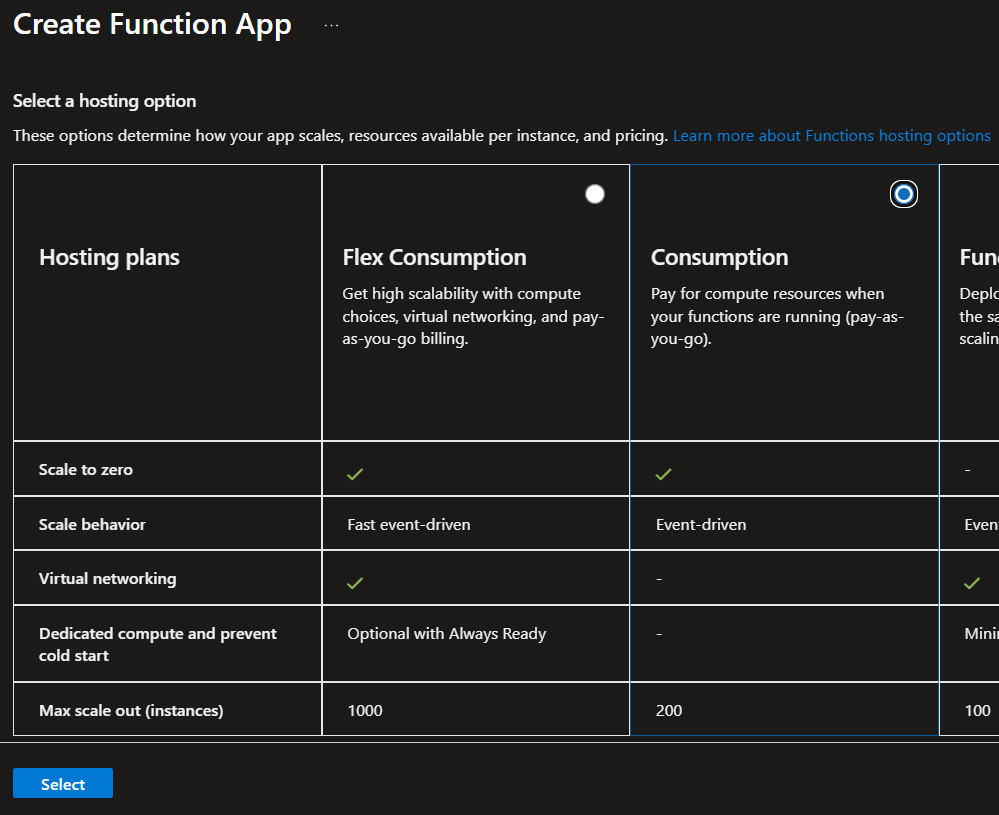

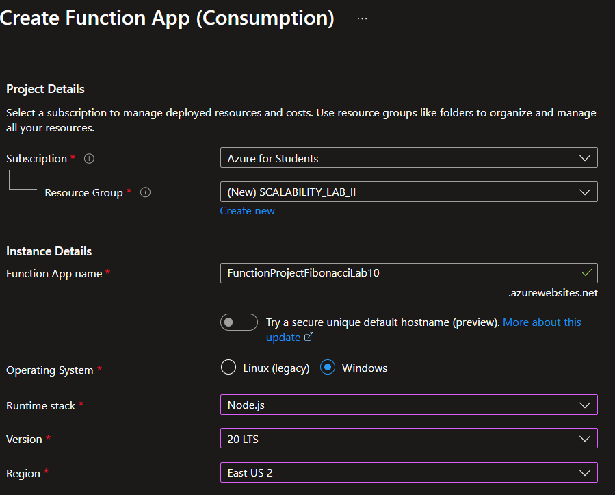

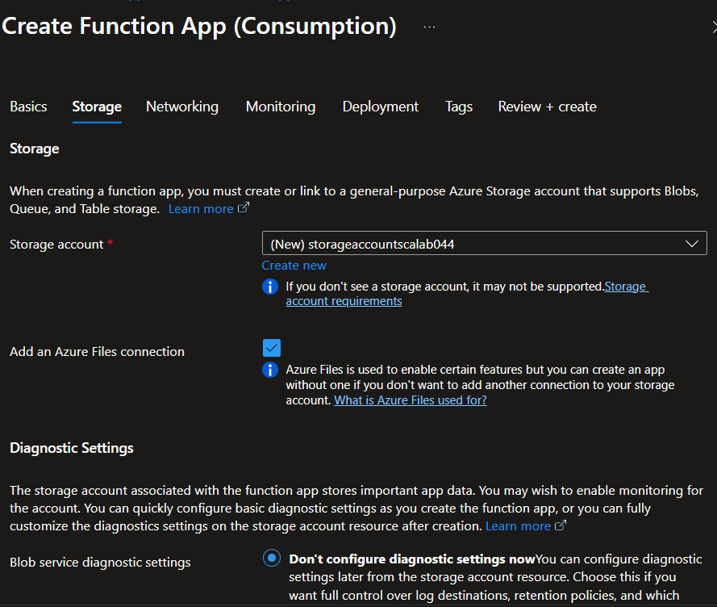

Con eso ya queda correctamente creada.

2. Instale la extensión de **Azure Functions** para Visual Studio Code.

Realizamos la instalacion de la extension en Visual:

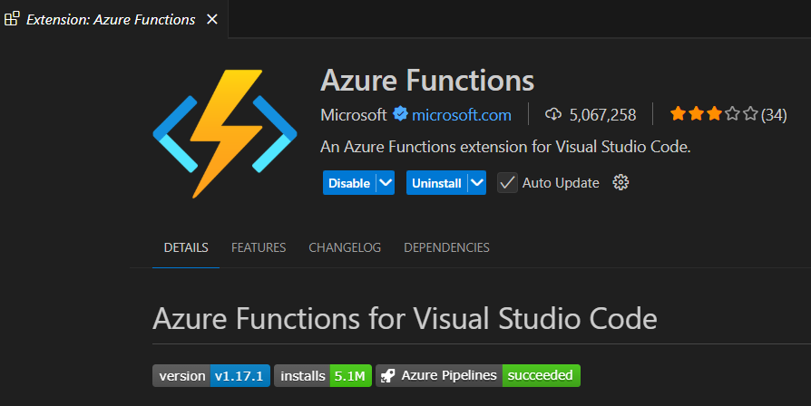

3. Despliegue la Function de Fibonacci a Azure usando Visual Studio Code. La primera vez que lo haga se le va a pedir autenticarse, siga las instrucciones.

Primero debemos autenticarnos en Visual con nuestra cuenta de Azure:

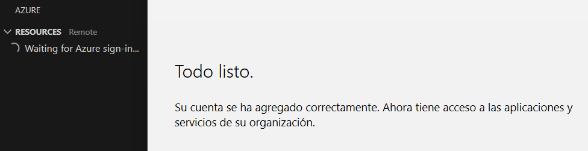

Una vez hecho eso vamos a desplegar en la Function App que creamos, aunque primero fue necesario modificar el archivo de host.json, porque no estaba funcionando el despliegue:

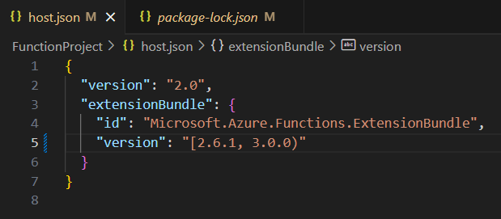

Ahora si vamos a desplegar:

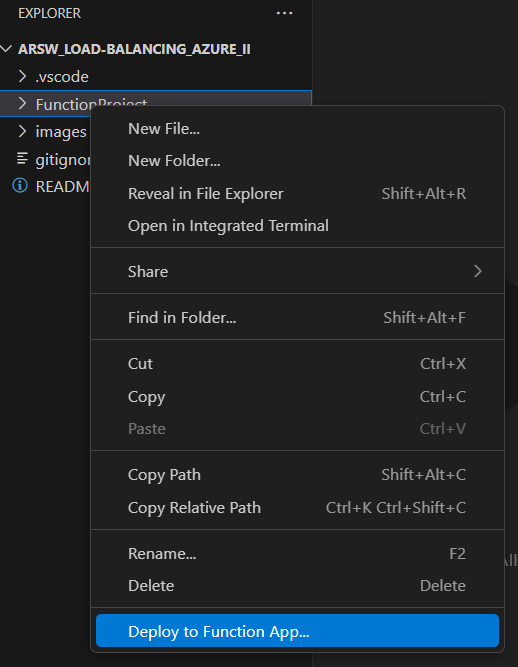

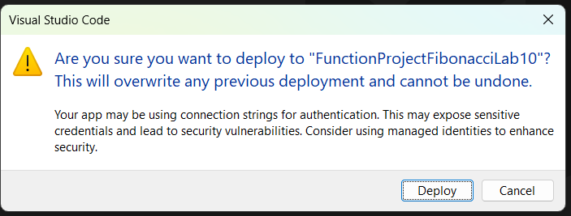

Ya quedo correctamente desplegado.

4. Dirijase al portal de Azure y pruebe la function.

En el portal de azure vamos a ir nuestra funcion de Fibonacci, y vamos a probar que si este funcionando con un test:

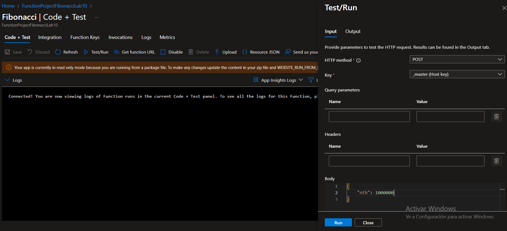

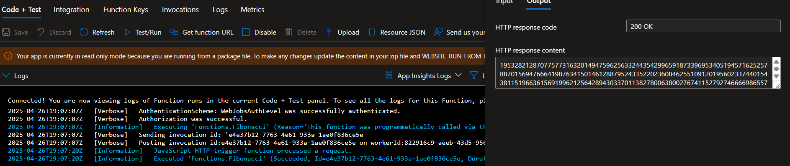

Se pudo observar que esta funcionando todo correctamente.

5. Modifique la coleción de POSTMAN con NEWMAN de tal forma que pueda enviar 10 peticiones concurrentes. Verifique los resultados y presente un informe.

Lo primero que debemos hacer es crear la coleccion de postman que va a ser la que ejecutemos para enviar las peticiones de manera concurrente. Para hacerlo nos basamos en lo trabajado en el laboratorio pasado y le cambiamos algunas cosas:

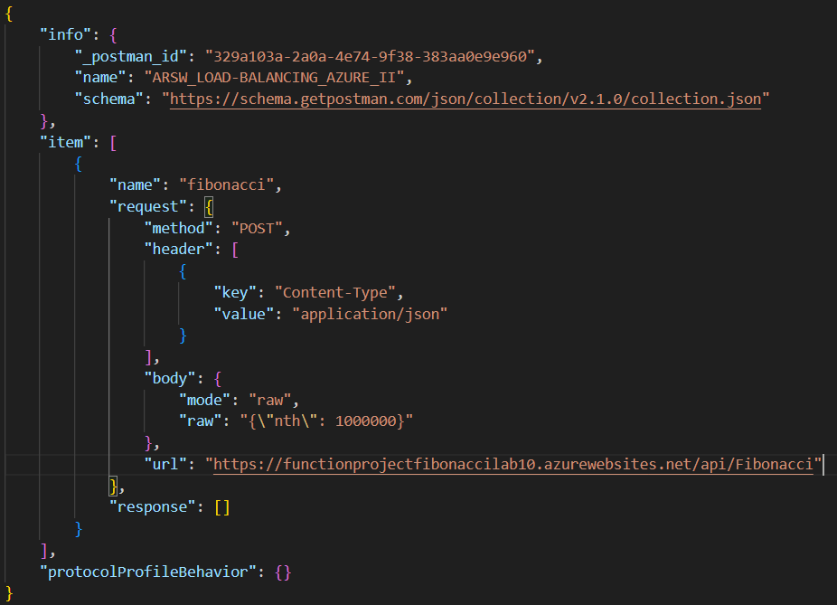

Ahora vamos a probar con NEWMAN:

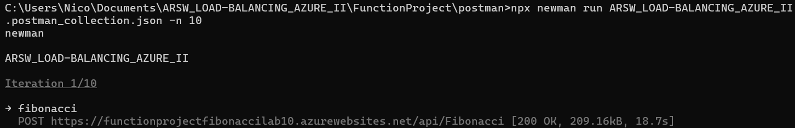

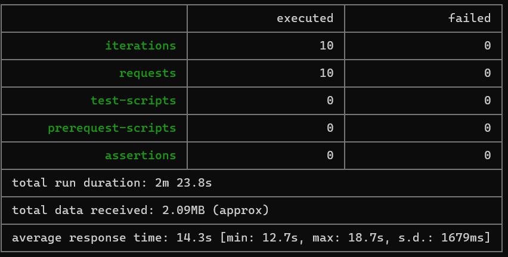}

Como se puede observar todas las peticiones fueron exitosas, y no tardaron mucho.

6. Cree una nueva Function que resuleva el problema de Fibonacci pero esta vez utilice un enfoque recursivo con memoization. Pruebe la función varias veces, después no haga nada por al menos 5 minutos. Pruebe la función de nuevo con los valores anteriores. ¿Cuál es el comportamiento?.

Primero modificamos el codigo para que resuelva el problema de Fibonacci de manera recursiva y conn memoization:

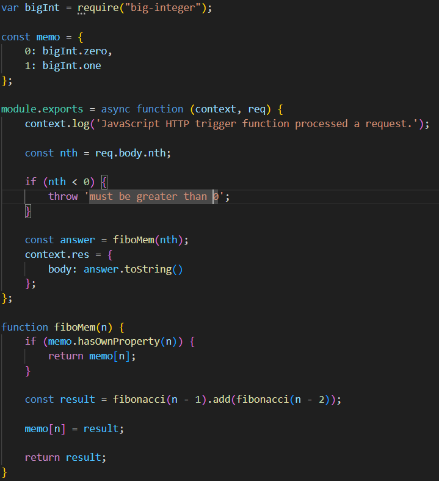

Debemos volver a desplegar para que el codigo se actualice, una vez hecho esto vamos a hacer una prueba para ver que si este funcionando:

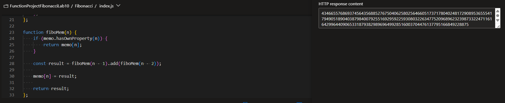

Como se puede observar si funciona.

Continuamos haciendo mas pruebas y nos dimos cuenta de que si le pediamos un numero muy grande como 500000, no servia y lanzaba error, asi que lo que hicimos fue ir subiendo poco a poco, comenzamos con 1000, 5000, 10000, 20000, 30000 ... hasta llegar a 120000 y ahi si funcionaron todos los casos, ademas de que las respuestas fueron muy rapidas. Esto se debe a que al usar memoization y recursividad si le pediamos un numero muy grande desde el inicio no era capaz de obtener la respuesta, en cambio si ibamos subiendo poco a poco, iba "aprendiendo" y podia contestar correctamente.

Para terminar, esperamos mas de 5 minutos, e hicimos una ultima prueba usando NEWMAN, basicamente fue la misma prueba que hicimos anteriormente antes de cambiar la funcion. Los resultados fueron los siguientes:

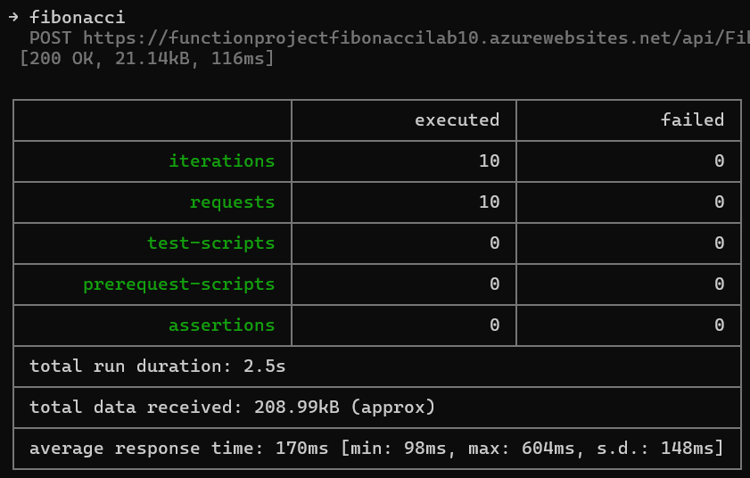

Como se puede observar ninguna peticion fallo, y ademas el tiempo que tardo fue muchisimo menor que antes de aplicar recursividad y memoization, la respuesta era casi instantanea.

**Preguntas**

* ¿Qué es un Azure Function?

Es un servicio de computación serverless que permite ejecutar pequeñas piezas de código, funciones, en la nube sin preocuparte por la infraestructura. Se activan por eventos como HTTP, colas o bases de datos, y escalan automáticamente según la demanda. Es ideal para tareas específicas, APIs ligeras o procesamiento de datos.

* ¿Qué es serverless?

Es un modelo de computación en la nube donde el proveedor como puede ser Azure, gestiona automáticamente la infraestructura. Un ejemplo es Azure Functions, y ademas posee caracteristicas como las siguientes:

- No hay servidores que administrar, ya que el proveedor los escala y mantiene.

- Solo se cobra cuando el código se ejecuta.

- Basado en eventos.

* ¿Qué es el runtime y que implica seleccionarlo al momento de crear el Function App?

El runtime en Azure Functions es el entorno que define la versión del lenguaje, como Node.js, las características disponibles y el soporte técnico. 

Al seleccionarlo al crear una Function App, determinas la compatibilidad con tu código, las dependencias admitidas y el ciclo de vida del soporte, evitando asi versiones obsoletas. Elegirlo correctamente asegura que tu función funcione sin problemas y se mantenga actualizada.

* ¿Por qué es necesario crear un Storage Account de la mano de un Function App?

Azure Functions requiere un Storage Account asociado porque lo utiliza internamente para almacenar el código de las funciones, registrar logs y estados de ejecución, gestionar colas para el escalado automático, y mantener metadatos de configuración. Este almacenamiento es esencial para el funcionamiento del runtime, sin él, la Function App no podría operar ni escalar correctamente, ya que Azure depende de estos servicios para la coordinación y persistencia básica de las operaciones.

* ¿Cuáles son los tipos de planes para un Function App?, ¿En qué se diferencias?, mencione ventajas y desventajas de cada uno de ellos.

| Plan           | Diferencias Clave                          | Ventajas                                     | Desventajas                                  |
|----------------|--------------------------------------------|---------------------------------------------|---------------------------------------------|
| **Consumption**| Escala a cero, pago por uso (GB-segundos)  | - Ideal para cargas impredecibles - Bajo costo (solo cuando se ejecuta) | - Cold starts - Límite de tiempo (10 min) |
| **Premium**    | Instancias precalentadas, VNET integration | - Sin cold starts - Escalado rápido - Mayor tiempo de ejecución (60 min) | - Costo más alto - Complejidad en configuración |
| **App Service**| VM dedicadas, escalado manual/automático   | - Ejecuciones ilimitadas - Control total (SO, red) - Precio predecible | - Sin escalado serverless - Overhead de gestión |

* ¿Por qué la memoization falla o no funciona de forma correcta?

En este caso falla o puede fallar, debido a que al inicio no hay ningun resultado guardado en memoria, esto quiere decir que se debe calcular cualquier numero que se solicite, si es un numero pequeño no pasa nada, pero si es un numero grande esto necesitaria de muchos recursos, y esto puede terminar generando un fallo debido a que no hay suficientes recursos. Es por eso que debiamos comenzar con numeros pequeños e ir incrementando progresivamente sin dar saltos muy grandes.

* ¿Cómo funciona el sistema de facturación de las Function App?

El sistema de facturación de Azure Functions depende del plan de hospedaje elegido:

1. Plan Consumption:

- Se cobra por tiempo de ejecución (GB-segundos) y número de ejecuciones. El costo se calcula en función de memoria asignada, tiempo de ejecucion y total de ejecuciones.

2. Plan Premium:

- Combina un costo fijo por instancia reservada (cores/memoria) + uso adicional, por ejemplo, si se escala más allá de las instancias precalentadas. Las instancias siempre activas evitan cold starts, pero tienen un precio base incluso sin uso.

3. Plan App Service:

- Precio fijo por la VM asignada, independientemente de las ejecuciones. Ideal para cargas constantes o ejecuciones largas, ya que tampoco hay un limite de tiempo.

* Informe

***Todo lo trabajado incluido el informe esta arriba, despues de cada numeral, pusimos lo que hicimos.***
